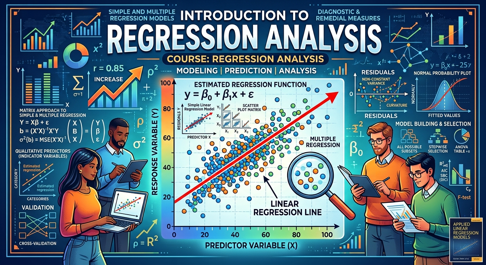

## Introduction

Regression is one of the most widely used statistical techniques across the sciences, social sciences,
and industry. This course develops both its theory and its practice: how regression models are built
and justified, and how to analyse data when they apply.

We begin with simple linear regression (least squares estimation, the geometry behind it, and inference
on the regression parameters under normally distributed errors) then extend to multiple regression in
matrix form, covering analysis of variance, confidence and prediction intervals, multicollinearity, and
models with both quantitative and qualitative predictors. The last part of the course asks what to do
when the standard assumptions fail: diagnostics, model selection and validation, and remedial measures
including weighted least squares. All computation is in R, and you will be expected to write R code,
interpret its output, and report your conclusions in writing.

More details can be found in the [syllabus](STAC67H3F-2026_Fall_Syllabus-20260902.docx),
[quercus](https://q.utoronto.ca/courses/464507) and [piazza](https://piazza.com/demo_login?nid=mtrg4rj858g237&auth=950bc81).

## Announcements

+ Lectures begin on September 9!

## Instructor

- Thibault Randrianarisoa, Office: IA 4064
  - Email: t.randrianarisoa@utoronto.ca (put "[STAC67]" in the subject, and your student number in the body)
  - Office hours: Wednesday 10–11am and Friday 3–4pm, IA 4064

Please use Piazza for questions about course content; email is reserved for private matters.

## Teaching Assistants

*To be announced.*

## Time & Location

| Section     | Day & time                                      | Location                     |
|:------------|:------------------------------------------------|:-----------------------------|
| **LEC01**   | Wednesday, 4:00 PM – 5:00 PM Friday, 1:00 PM – 3:00 PM | In person: IA 2021 In person: IA 2021 |
| **TUT0001** | Tuesday, 5:00 PM – 6:00 PM                       | In person: IA 3120           |
| **TUT0002** | Wednesday, 3:00 PM – 4:00 PM                     | In person: IC 208            |

Tutorials start in **Week 2** and run weekly. They are used for practical work in R and for the three
quizzes. Note that tutorials meet *before* that week's lectures, so a tutorial only assumes material
covered up to the previous Friday, and each quiz covers material up to the Friday of the week before.

## Suggested Reading

The course follows the chapter structure of _Applied Linear Regression Models_ (Kutner), the required text.

* **(Kutner)** Kutner, Nachtsheim & Neter (2004), _Applied Linear Regression Models_, 4th edition
  (older editions are fine). [Data sets and solution manual](http://www.cnachtsheim-text.csom.umn.edu)
* **(Sheather)** Simon J. Sheather (2009), _A Modern Approach to Regression with R_,(a lighter,
  R-centred companion, available online through the UofT library).

## Lectures and (tentative) timeline

Slides and annotated slides will be posted here after each class.

| Week                                    | Lectures                                                                                                                                                                                                                                                          | Suggested reading            | Tutorial                                                             | Timeline                                                                      |
|:----------------------------------------|:------------------------------------------------------------------------------------------------------------------------------------------------------------------------------------------------------------------------------------------------------------------|:-----------------------------|:---------------------------------------------------------------------|:------------------------------------------------------------------------------|
| Week 1  7–13 September           | Introduction; what regression is; data visualisation; covariance and correlation [Lecture 1](Lecture1.pdf)    Correlation and its test; data collection and the regression process; the simple linear regression model  [Lecture 2](Lecture2.pdf) |  Kutner 1.1–1.3   Kutner 2.11 |                                                                      |                                                                               |
| Week 2  14–20 September          | Least squares estimation; the Gauss–Markov theorem; interpretation of $\sigma^2$; fitted values and residuals    Inference on the regression parameters: confidence intervals and hypothesis tests                                                        | Kutner 1.4–1.7   Kutner 2.1–2.2 | Tutorial 1   R, RStudio and R Markdown                            | Assignment 1 out (Sep 18)                                                     |
| Week 3  21–27 September          | Sampling distribution of the estimators; interval estimation of the mean response; prediction intervals    Analysis of variance; the coefficient of determination                                                                                         | Kutner 2.3–2.6   Kutner 2.7–2.9 | Tutorial 2   Descriptive statistics and `ggplot2`                 |                                                                               |
| Week 4  28 September–4 October   | F- and t-tests; descriptive measures of association; model assumptions and residual plots    Matrices and random vectors; simple linear regression in matrix form; the hat matrix                                                                         | Kutner 3.1–3.3   Kutner 5.1–5.10 | Tutorial 3   Simple linear regression in R                        | Quiz 1   **Assignment 1 due (Sep 30)**                                    |
| Week 5  5–11 October             | Useful matrix results    Properties of linear functions of random vectors; properties of the estimators, fitted values, residuals and predictions                                                                                                         | Kutner 5.11–5.13   Kutner 6.1–6.4 | Tutorial 4   ANOVA table, $R^2$, sampling distributions by simulation | Assignment 2 out (Oct 7)   **Project brief (Oct 9)**                      |
| Week 6  12–18 October            | The geometry of least squares    Inference for the mean response and a new observation; quadratic forms; the overall F-test                                                                                                                               | Kutner 6.5–6.8               | Tutorial 5   Matrix algebra in R                                  |                                                                               |
| Week 7  19–25 October            | General linear hypothesis testing; extra sums of squares    Multicollinearity and its effects; qualitative predictors                                                                                                                                     | Kutner 7.1–7.5   Kutner 7.6, 8.3 | Tutorial 6   Fitting and interpreting multiple regression         | **Assignment 2 due (Oct 21)**   **Midterm**                               |
| Week 8  26 October–1 November    | **Reading Week**                                                                                                                                                                                                                                                  |                              |                                                                      |                                                                               |
| Week 9  2–8 November             | One continuous and one categorical predictor    Interaction models; case study                                                                                                                                                                            | Kutner 8.3–8.6               | Tutorial 7   Multiple regression inference                        | Quiz 2   Assignment 3 out   **Groups + datasets due (Nov 6)**         |
| Week 10  9–15 November           | Polynomial regression models; centred predictors    Variable transformations                                                                                                                                                                              | Kutner 8.1–8.2   Kutner 3.9 | Tutorial 8   Categorical predictors, interactions, ANCOVA         | **Project checkpoint due (Nov 13)**                                           |
| Week 11  16–22 November          | Model selection and validation: criteria and procedures    Diagnostics: outlying $Y$ and $X$ observations, leverage                                                                                                                                       | Kutner 9.1–9.6   Kutner 10.1–10.3 | Tutorial 9   Polynomial fits and transformations                  | **Assignment 3 due (Nov 18)**                                                 |
| Week 12  23–29 November          | Influential observations; multicollinearity diagnostics    Remedial measures: weighted least squares                                                                                                                                                      | Kutner 10.4–10.5   Kutner 11.1 | Tutorial 10   Model selection and diagnostics                     | Quiz 3   **Project report due (Nov 27)**   *Last day to drop: Nov 24* |
| Week 13  30 November–6 December  | Shrinkage methods: the bias–variance trade-off, ridge regression and the LASSO    **Project presentations**; course review                                                                                                                                | Kutner 11.2                  | Tutorial 11   Exam revision                                       | **Presentations (Dec 4)**                                                     |

## Assessments

The **midterm** is scheduled by the Registrar's Office in the week of **October 19–25** and covers
material through Week 6. The **final exam** falls in the examination period, **December 10–22**, and
covers the whole term. Dates, times and rooms are announced by the Registrar.

Practice papers and statistical tables will be posted here.

### Assignments

| Assignment       | Out            | Due                          | Solutions |
|:-----------------|:---------------|:-----------------------------|:----------|
| **Assignment 1** | September 18th | September $30^{\text{th}}$, 23:59 |           |
| **Assignment 2** | October 7th    | October $21^{\text{st}}$, 23:59   |           |
| **Assignment 3** | November 4th   | November $18^{\text{th}}$, 23:59  |           |

Late submissions are not accepted.

### Quizzes

Three quizzes, written in tutorial. The **best two of three** count, and there are no make-up quizzes.

| Quiz       | Tutorial                  | Covers                     | Solutions |
|:-----------|:--------------------------|:---------------------------|:----------|
| **Quiz 1** | Week 4 (Sep 28 / Oct 4)   | through Friday October 2   |           |
| **Quiz 2** | Week 9 (Nov 3 / Nov 4)    | through Friday October 23  |           |
| **Quiz 3** | Week 12 (Nov 24 / Nov 25) | through Friday November 20 |           |

### Case study project (optional)

Groups of **at most four**, working on a dataset from a pre-approved list, assessed on a checkpoint, a
written report in R Markdown, and a five-minute presentation.

Your grade is computed both with and without the project, and **you receive whichever is higher**, so
the project counts whenever your project mark beats your final exam mark. It can raise your grade and
can never lower it. See the syllabus for the formula.

| Milestone                                | Date                            | Materials |
|:-----------------------------------------|:--------------------------------|:----------|
| Brief and dataset list released          | October 9th                     |           |
| Groups and dataset claimed (binding)     | **November 6th**                |           |
| Checkpoint: research question + EDA      | **November 13th**               |           |
| Report due                               | **November 27th**, 23:59        |           |
| Presentations                            | **December 4th**                |           |

## Computing Resources

All computation in this course is in **R**, and you are expected to write R code and interpret R output
on assignments, quizzes and tests.

* Install [R](https://www.r-project.org/) (free, all platforms), then
  [RStudio Desktop](https://posit.co/download/rstudio-desktop/) as the editor.
* Reports are written in **R Markdown**, which produces a PDF or HTML document from code and prose in
  one file. It is covered in Tutorial 1.
* Figures use [`ggplot2`](https://ggplot2.tidyverse.org/). Install the packages used in the course with
  `install.packages(c("ggplot2", "dplyr", "car", "leaps", "MASS", "glmnet"))`.
* Useful references: [R for Data Science](https://r4ds.hadley.nz/),
  the [R Markdown](https://rmarkdown.rstudio.com/lesson-1.html) lessons, and the
  [ggplot2 cheat sheet](https://posit.co/resources/cheatsheets/).
